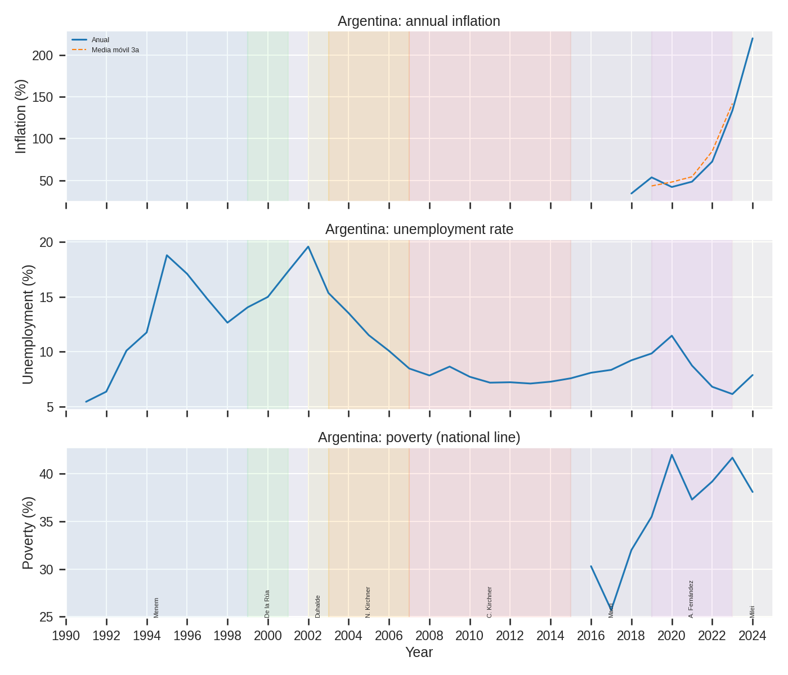
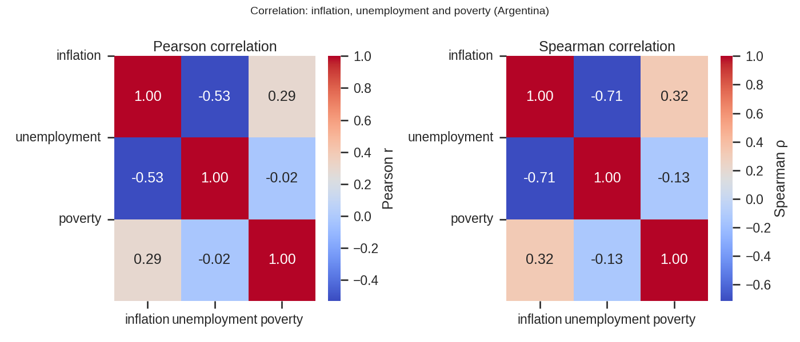
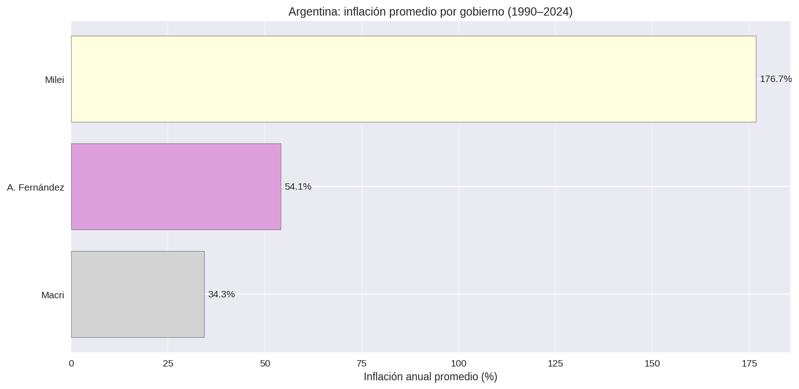

# 🇦🇷 Argentina Macro Crisis Analysis (1990–2024)

[](https://www.python.org)
[](https://pandas.pydata.org)
[](https://scipy.org)
[](tests/)
[](LICENSE)
[](https://data.worldbank.org)

<br/>

<div align="center">
  
</div>

<br/>

> **35 años de datos del Banco Mundial. 8 presidencias. 3 crisis sistémicas.**  
> Argentina no ha sostenido estabilidad macroeconómica desde la convertibilidad. Con inflación en **219.9% en 2024**, pobreza sobre el **38%** de la población, y un desempleo que tocó fondo en **19.6% durante la crisis de 2001**, este análisis construye el mapa de datos que cualquier estrategia de estabilización debe considerar.

---

## 📊 Key Findings

- 📈 **Inflación 2024: 219.9% anual** — el nivel más alto del período; sin estabilización duradera desde los 90
- 🏚️ **Pobreza estructural sobre el 38%** desde 2019, alcanzando el 42% en la pandemia (2020)
- 📉 **Pico de desempleo: 19.6% en 2002** tras el colapso de la convertibilidad; hoy en 7.9%
- 🔗 **Inflación erosiona poder adquisitivo:** correlación Pearson inflación-pobreza de **+0.29** — los shocks inflacionarios empujan pobreza incluso sin aumentos de desempleo
- ↕️ **Trade-off de Phillips documentado:** correlación inflación-desempleo de **−0.53** — el dilema clásico se cumple en los datos argentinos
- 🔄 **8 gobiernos, mismo patrón estructural:** ninguna administración logró estabilización inflacionaria duradera desde Menem (1990–1999)

---

## 🖼️ Análisis Visual

<div align="center">

| Series temporales (1990–2024) | Correlaciones Pearson vs. Spearman |
|:---:|:---:|
|  |  |
| *Inflación, desempleo y pobreza por período presidencial* | *Relación entre los tres indicadores — Pearson y Spearman* |

</div>

<br/>

<div align="center">
  
  <br/><em>Inflación anual promedio por gobierno — la persistencia del problema en una sola imagen</em>
</div>

---

## 🗃️ Dataset & Metodología

**Fuente:** [World Bank Development Indicators (WDI)](https://data.worldbank.org) para Argentina (`ARG`) — descarga diciembre 2024.

| Indicador | Código WDI | Descripción |
|-----------|-----------|-------------|
| Inflación | [`FP.CPI.TOTL.ZG`](https://data.worldbank.org/indicator/FP.CPI.TOTL.ZG?locations=AR) | Variación anual del IPC (%) |
| Desempleo | [`SL.UEM.TOTL.ZS`](https://data.worldbank.org/indicator/SL.UEM.TOTL.ZS?locations=AR) | % de la fuerza laboral (estimación OIT modelada) |
| Pobreza | [`SI.POV.NAHC`](https://data.worldbank.org/indicator/SI.POV.NAHC?locations=AR) | % de población bajo línea de pobreza nacional |

**Pipeline:**
1. Carga y reshape de CSVs del Banco Mundial (formato _wide_ → _long_)
2. Validación de integridad: rangos esperados, warnings automáticos para anomalías
3. Series temporales con períodos presidenciales superpuestos y media móvil de 3 años
4. Correlaciones Pearson y Spearman con p-values (`scipy.stats`)
5. Exportación de reporte HTML con estadísticas descriptivas completas

Ver [`data/README.md`](data/README.md) para documentación detallada de los datasets.

---

## 🛠️ Stack Tecnológico


---

## ▶️ Reproducir el análisis

```bash
git clone https://github.com/federicoramos67/argentina-macro-exit-plan.git
cd argentina-macro-exit-plan
pip install -r requirements.txt
python run.py
```

Los gráficos se generan en `reports/` e `images/`. Para explorar el análisis interactivo:

```bash
pip install jupyter
jupyter notebook notebooks/Argentina_macro_exit_plan.ipynb
```

---

## 📁 Estructura del Repositorio

```
argentina-macro-exit-plan/
├── images/                    ← Visualizaciones exportadas (usadas en este README)
├── data/                      ← Datasets WDI del Banco Mundial
│   └── README.md              ← Documentación de fuentes y metodología de descarga
├── notebooks/                 ← Análisis exploratorio interactivo (bilingüe ES/EN)
├── src/                       ← Código modular de producción
│   ├── config.py              ← Constantes: gobiernos, períodos, rutas
│   └── main.py                ← Pipeline completo: carga, validación, análisis, visualización
├── tests/                     ← 21 tests unitarios e integración (pytest)
├── reports/                   ← Outputs generados por run.py
├── run.py                     ← Entry point con --verbose flag
└── requirements.txt           ← Dependencias con versiones mínimas
```

---

## 👤 Autor

**Federico Ramos** · [@federicoramos67](https://github.com/federicoramos67)

---

*Datos: World Bank Open Data (CC BY 4.0) · Análisis: abril 2026*
